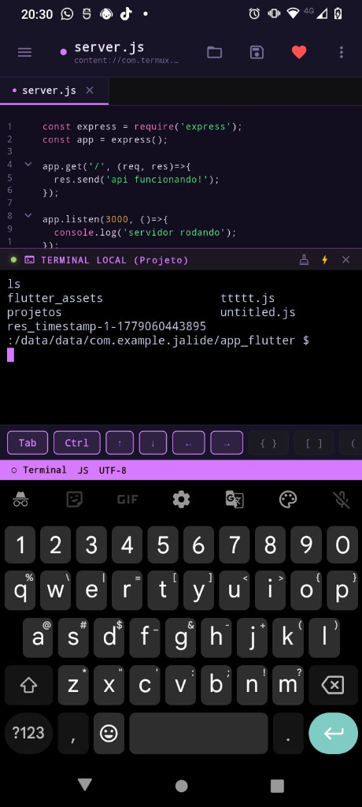
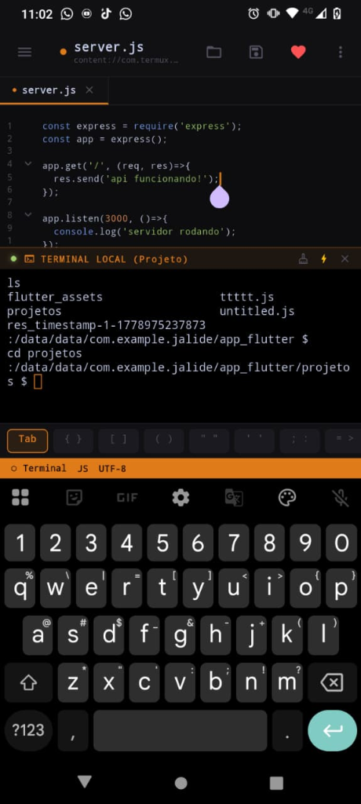
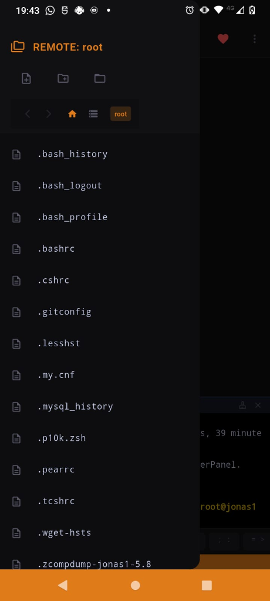

# JALIDE Mobile IDE 🚀

**Transforme seu Android em uma estação de desenvolvimento completa.**

[](https://flutter.dev)
[](https://android.com)
[](LICENSE)
[]()

<p align="center">
  
  
  
</p>

---

## Sobre

JALIDE é uma IDE móvel moderna e poderosa desenvolvida em Flutter, com suporte **multi-linguagem** (JavaScript, Python, Dart, C, C++ e Shell Script). Ela foi projetada para transformar seu Android em um ambiente de desenvolvimento robusto, ideal para quando você está em trânsito ou tem apenas o celular à mão — sem abrir mão de produtividade e recursos avançados.

---

## ✨ Funcionalidades

| | Funcionalidade | Descrição |
|---|---|---|
| 📝 | **Editor profissional** | Syntax highlighting, zoom dinâmico e múltiplas abas |
| 🤖 | **Autocomplete por linguagem** | Sugestões inteligentes como VSCode (JS, Python, Dart, C++, etc.) — muda conforme você abre arquivos |
| ▶️ | **Play Inteligente** | Botão de execução direta na barra superior que roda códigos com um toque (Node, Python, Dart, C/C++, Bash) |
| 💾 | **Auto-Save Background** | Salvamento automático silencioso (com debounce de 1.5s) e ao trocar de abas no editor |
| 🐚 | **Terminal híbrido** | Alterne entre terminal local (Android) e remoto via SSH |
| ⚡ | **Termux Magic** | Configura Node.js + SSH no Termux com um clique |
| 📂 | **SFTP nativo** | Edite arquivos remotos como se fossem locais |
| 🔐 | **Gestor de perfis SSH (melhorado)** | Credenciais seguras, testar conexão, indicador de status (ONLINE/OFFLINE), desconectar com um clique |
| 🎹 | **Teclado auxiliar** | Atalhos `{}` `[]` `=>` otimizados para telas pequenas |

---

## 🎯 O que há de novo (v0.1.0+5)

### 🤖 Integração com IA (Google Gemma)
- **Assistente IA Gratuito** — Tire dúvidas, peça sugestões ou gere códigos conversando com a IA usando a Chave de API do Google AI Studio.
- **Sugestões Contextuais (Ghost Suggestions)** — IA analisando seu código em tempo real e oferecendo sugestões (ativável nas configurações).
- **Sem Limites Ocultos** — O aplicativo conecta diretamente ao seu provedor, então não há custos ou taxas escondidas!

### 🧹 Auto-Format Offline
- **Formatação de Código Sem IA** — Mantendo a essência do "máximo grátis", implementamos um formatador embutido para limpar recuos e espaços.
- **Auto-Format on Save** — Option para formatar o código magicamente toda vez que você salvar.

### 📱 Experiência Mobile Melhorada
- **Seleção de Texto Inteligente** — Corrigido o comportamento do toque; agora toques curtos apenas movem o cursor, evitando menus de seleção indesejados. Segure o dedo para ativar a seleção de texto.

---

## 🎯 Na versão anterior (v0.1.0+4)

### 🚀 Autocomplete Inteligente
- **Digite e veja:** Conforme você digita, sugestões relevantes aparecem (como no VSCode).

### 🔐 SSH Melhorado
- **Testar conexão** — Botão para verificar se o servidor está respondendo antes de trabalhar.
- **Status em tempo real** — Indicador `🟢 ONLINE` ou `🔴 OFFLINE` próximo a cada perfil salvo.
- **Desconectar com 1 clique** — Encerra a sessão SSH quando terminar (libera recursos).
- **Memory-safe** — Sem memory leaks ao deletar perfis ou desconectar.

---

Para usar o potencial máximo (Node.js, NPM, Git), integre o JALIDE ao **[Termux](https://termux.dev)**.

### ⚡ Passo 1 — Termux Magic (jeito fácil)

1. Abra o JALIDE e toque no ícone de **terminal** no rodapé.
2. No painel do terminal, toque no ícone de **Raio Amarelo ⚡**.
3. Toque em **"COPIAR E ABRIR TERMUX"**.
4. No Termux, **cole o comando** e dê Enter — ele instala o Node.js e o servidor SSH automaticamente.
5. Defina uma senha com `passwd` e anote seu usuário com `whoami`.

> **⚠️ Guarde** seu usuário e senha — você vai precisar deles no próximo passo.

---

### 🔌 Passo 2 — Conectar via SSH

1. No JALIDE, toque em **⋮** (menu superior) → **SSH Remote**.
2. Toque em **(+)** para adicionar um novo perfil:

   | Campo | Valor |
   |---|---|
   | Host | `localhost` |
   | Porta | `8022` |
   | Usuário | resultado do `whoami` |
   | Senha | definida no `passwd` |

3. Salve e toque em **Conectar**. ✅

---

## 📂 Editando Arquivos Remotamente (SFTP)

O JALIDE oferece um **file explorer remoto completo**, não apenas um terminal:

- **Conectar** → o explorer abre automaticamente na pasta `home` do servidor remoto.
- **Abrir** → toque em qualquer arquivo para carregá-lo no editor.
- **Salvar** → `Ctrl+S` faz o upload via SFTP instantaneamente.
- **Persistência** → feche o terminal para ganhar espaço na tela; a sessão SSH continua ativa em segundo plano.

---

## 🤝 Como Contribuir

JALIDE é **100% open-source**. Issues, sugestões e PRs são muito bem-vindos!

```bash
# 1. Fork o repositório e clone
git clone https://github.com/seu-usuario/jalide.git

# 2. Crie sua branch
git checkout -b minha-feature

# 3. Commit suas mudanças
git commit -m 'feat: minha contribuição'

# 4. Push e abra um Pull Request
git push origin minha-feature
```

---

## 💖 Apoie o Projeto

Se o JALIDE te ajuda a programar, considere apoiar o projeto com uma estrela ⭐ no repositório ou fazendo uma contribuição voluntária via PIX direto pelo aplicativo!

Chave PIX do projeto:
`40dccccc-04fa-4c63-959d-f671794d5f27`

---

## 📝 Licença

Distribuído sob a licença **MIT**. Veja [`LICENSE`](LICENSE) para mais informações.

---

*Desenvolvido com ❤️ para a comunidade de desenvolvedores mobile.*
